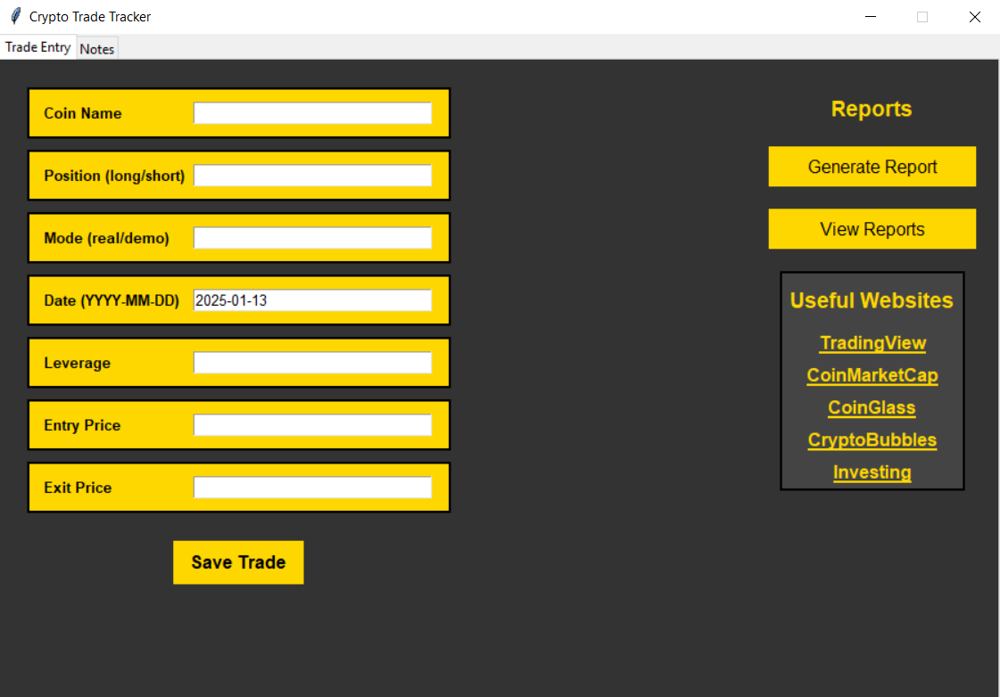
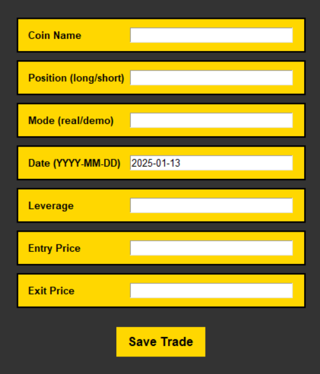
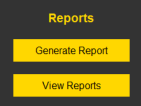
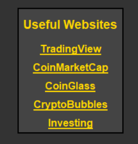
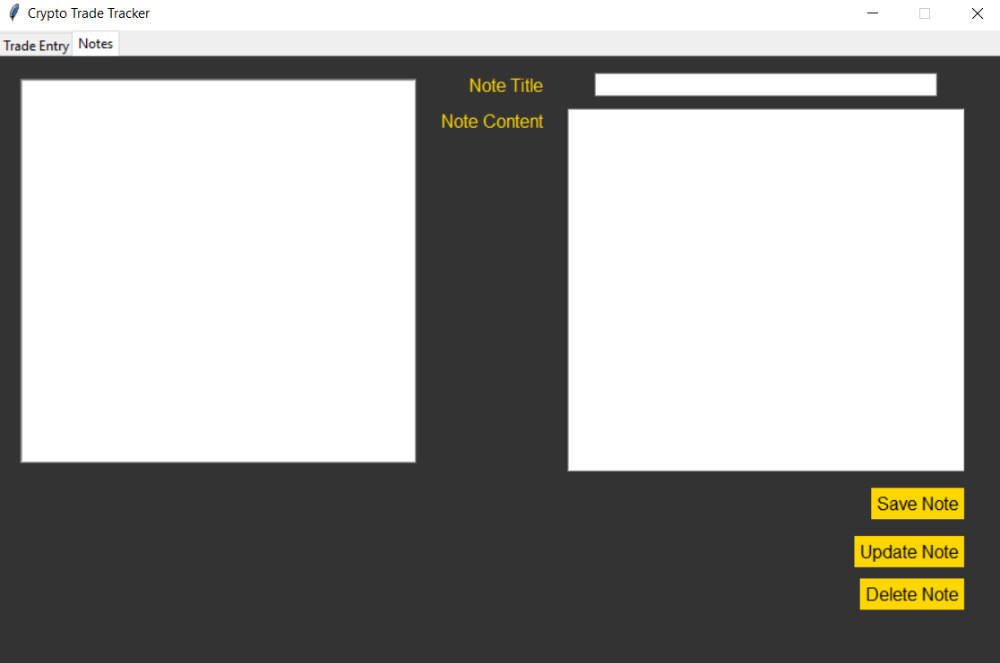
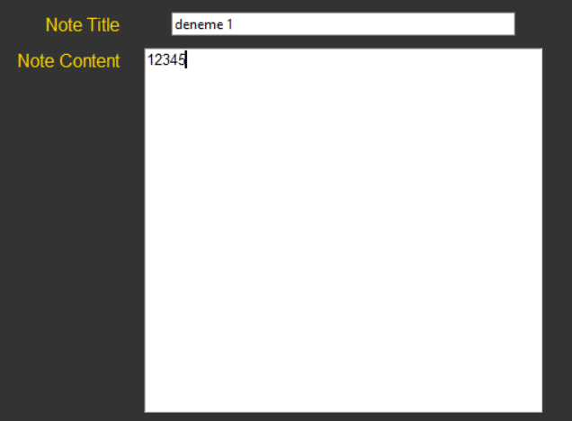
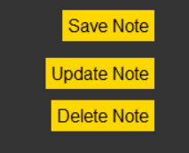
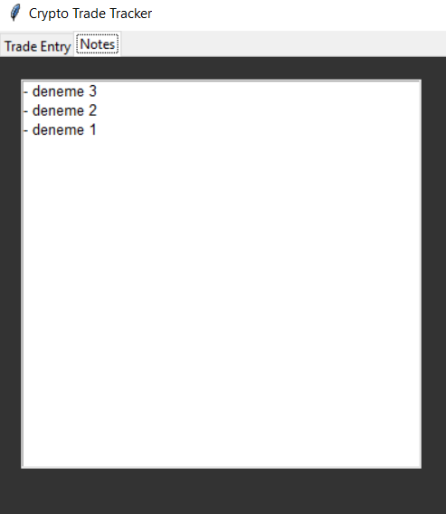

# TRADE JOURNAL
---

## Project Description
**Trade Journal** is a **Python** project designed to simplify the tracking of your cryptocurrency trading activities. This project allows you to log, manage, and analyze your trading data in an organized manner. With **Trade Journal**, you can:
- **Trade Entry**: Easily and quickly log your trading activities.
- **Data Management**: All your trades are securely stored in an SQLite database and can be easily accessed when needed.
- **Analysis and Reporting**: Provides basic analysis tools and reports to evaluate your trading performance.
- **Note Taking**: Allows you to record and review your trading strategies and important notes.

**Trade Journal** aims to help you manage your trading activities more systematically and efficiently, supporting your decision-making processes. With its user-friendly interface and robust data management features, it is an ideal tool for both beginners and experienced traders.

---
## Requirements
- Python 3.13.1
- fpdf2 2.8.2 (**WARNING**: Having both `fpdf` and `fpdf2` may cause conflicts. It is recommended to uninstall `fpdf` and install only `fpdf2`.)
- All other libraries used are part of Python's standard libraries.

---
## Running the Project

1. **Setting Up the SQLite Database**

    Before running the project, you need to set up the SQLite database.

    - Open your terminal or command prompt and navigate to the project directory:
      ```bash
      cd path/to/trade_journal
      ```
    - Run the `setup_database.py` script to create the `trade_data.db` SQLite database and necessary tables:
      ```bash
      python setup_database.py
      ```

2. **Populating the Database with Test Data (Optional)**

    If you want to test the database, you can skip this step or run the `populate_trades.py` script to add 200 random trades:
    
    - Navigate to the project directory:
      ```bash
      cd path/to/trade_journal
      ```
    - Run the `populate_trades.py` script:
      ```bash
      python populate_trades.py
      ```

3. **Launching the GUI Application**

    - Navigate to the project directory:
      ```bash
      cd path/to/trade_journal
      ```
    - Run the `main_gui.py` script to start the Tkinter-based GUI application:
      ```bash
      python main_gui.py
      ```

---
## Using the Project

The GUI application consists of two main sections: data entry and note management.

### **Main Screen**


### **Data Entry**


- **Coin Name**: Enter the name of the cryptocurrency.
- **Position (long/short)**: Specify whether the position is long or short.
- **Mode (real/demo)**: Indicate whether the trade is real or a demo for testing purposes.
- **Date (YYYY-MM-DD)**: Enter the date of the trade. If not specified, the current date is used.
- **Leverage**: Enter the leverage level used. Enter 1 if trading spot.
- **Entry Price**: Enter the entry price of the coin.
- **Exit Price**: Enter the exit price of the coin.
- **Save Trade**: Click to save the trade data to the database after filling in all parameters correctly.

### **Report Generation**


- **Generate Report**
    - Click to generate a report using the data from the database. The report is saved in the `reports` folder as a PDF and is displayed directly.
    - If you create multiple reports at different times of the day, the new report will overwrite the old one to save space and prevent clutter.
    - Reports are saved with the `report_date` format, allowing you to view your trading status on specific dates by opening the corresponding report.

- **View Reports**
    - This button automatically opens the `reports` folder for easy access.

### **Accessing Useful Websites**


- **TradingView**: Used for technical analysis.
- **CoinMarketCap**: Provides market values, volumes, and other data of coins.
- **CoinGlass**: Offers detailed analysis tools like liquidation maps and funding rates.
- **CryptoBubbles**: Displays the rise and fall percentages of coins in an engaging way.
- **Investing**: Used to check the economic calendar and important news.

### **Notes**


### **Note Entry**


- **Note Title**
    - Enter the title of your note.
  
- **Note Content**
    - Enter the content of your note.

### **Saving, Updating, Deleting, and Viewing Notes**


- **Save Note**
    - This button only saves the note.

- **Update Note**
    - This button only updates previously saved notes. Do not use it to save new notes.

- **Delete Note**
    - This button deletes the selected note.

- **Notes Display**
    - Saved notes are displayed on the left side of the screen.


---
## Things to Keep in Mind

1. **Consistent Coin Naming**
    - Ensure that you consistently use the same name for each coin when entering data. Different names can complicate data analysis.

2. **Verify Parameter Accuracy**
    - Before saving data, double-check the accuracy of all entered parameters. Incorrect data can lead to errors in analysis and reporting.

3. **Note Saving and Updating Procedures**
    - The **Save Note** button is only for saving new notes. Do not use it to update existing notes.
    - The **Update Note** button is solely for updating existing notes. Do not use it to save new notes.
    - If you need to update a note, make sure to click the **Update Note** button.

4. **Deleting Notes**
    - Ensure that the note you intend to delete is selected before clicking the delete button. Attempting to delete an unselected note can cause errors.

5. **Duplicate Notes Risk**
    - If you save the same note twice, changes made will affect both notes, including deletion. Avoid duplicating notes to prevent confusion.

6. **Database Resetting**
    - Before resetting the database, make sure to back up your current data. This prevents data loss and allows you to revert if necessary.

7. **Organized Project Files**
    - Ensure that all `.py` files and necessary folders (`images/`, `reports/`, etc.) are in the same directory. An organized file structure facilitates easier project execution.

8. **Report Generation Accuracy**
    - When generating reports, ensure that there are no missing or incorrect data entries in the database. This enhances the accuracy of the reports.

9. **Ensure Required Packages and Versions are Installed**
    - Verify that the necessary Python version and libraries are installed to avoid runtime errors.

---
## Contact
For any questions, suggestions, or feedback regarding the project, please feel free to reach out to me:

- **Name:** Mahmut Eren Çakır
- **Email:** meren.ckr23@gmail.com

---
